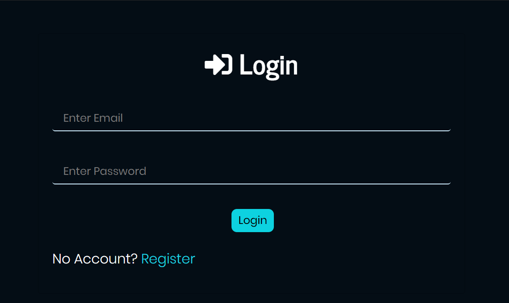
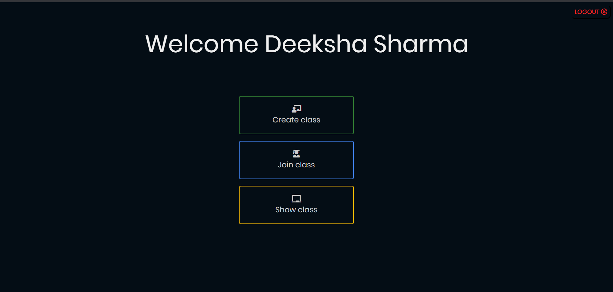
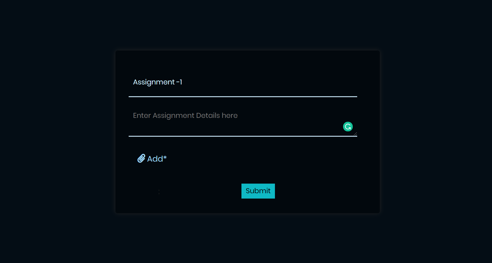
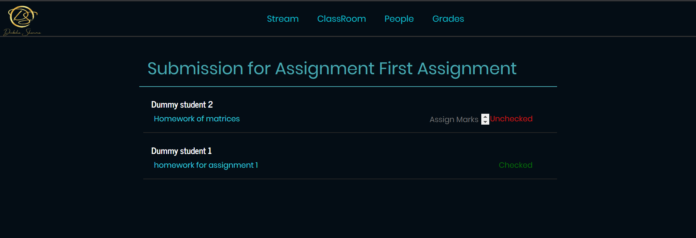

# Virtual Classroom(Web-App)
A web application for online classroom where you can create your own class or can join someone else's. An online Assignment creation / submission and Grading application.
Check it out at [DS Classroom](https://dsvirtualclassroom.herokuapp.com/) 😉

## Setting up

    npm install
    npm run devStart

Page will automatically get refreshed after you change anything in your files.

```
assignment-privado
├── .env
├── .gitignore
├── node_modules
├── package.json
├── Procfile
├── package.lock.json
├── README.md
├── app.js
├── assignment
│   ├── app.js
├── homework
│   ├── app.js
├── config
│   ├── auth.js
│   ├── key.js
│   ├── password.js
├── db
│   ├── projectdb.js
│   ├── schema.js
├── models
│   ├── User.js
├── models
│   ├── User.js
│   ├── key.js
│   ├── password.js
├── public
│   ├── DSwithname.png
│   ├── dash_img.png
│   ├── stylesheet.css
├── routes
│   ├── index.js
│   ├── users.js
│   ├── password.js
├── views
│   ├── dashboard.ejs
│   ├── index.ejs
│   ├── layout.ejs
│   ├── login.ejs
│   ├── post_something.ejs
│   ├── register.ejs
│   ├── welcome.ejs
    └── faculty
    |   ├── class_creation.ejs
    |   ├── classes.ejs
    |   ├── faculty_assign_create.ejs
    |   ├── faculty_classwork.ejs
    |   ├── faculty_dashboard.ejs
    |   ├── faculty_students.ejs
    |   ├── faculty_submitted_hw.ejs
    └── faculty
    |   ├── create_assignment.ejs
    |   ├── given_assignment.ejs
    |   ├── join-class.ejs
    |   ├── student_classwork.ejs
    |   ├── student_dashboard.ejs
    |   ├── student_people.ejs
    |   ├── submitted_homework.ejs
    └── partials
    |   ├── footer.ejs
    |   ├── header.ejs
    
```
### Screenshots of the project

#### Login page


#### welcome page


#### Dashboard of user


#### Create Assignment by teacher


#### sunmitted work page(for student)

