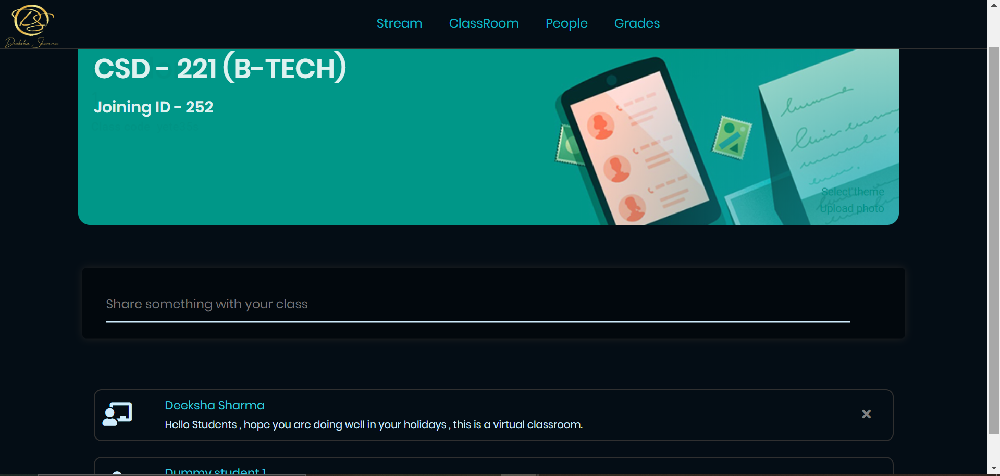

# Virtual Classroom(Web-App)
<!--A web application for online classroom where you can create your own class or can join someone else's. An online Assignment creation / submission and Grading application. -->

- A Full Stack web application for an online classroom where you can create your own class or can join someone else’s.
- Mentors/teachers can create assignments, create quiz/tests, add study materials and can grade students submissions.
Students can directly access all the study materials on one portal, can submit assignments, get graded and and can
even ask doubts on the portal.
- There is also a discussion tab where teachers can interact virtually with the class and students can ask their queries.

Check it out at [DS Classroom](https://dsvirtualclassroom.herokuapp.com/) 😉


[](http://hits.dwyl.com/Deeksha2501/Online_Classroom_Web_App)

## Setting up

    npm install
    npm run devStart

Page will automatically get refreshed after you change anything in your files.

### Screenshots of the project

#### Welcome page


#### Dashboard of user


#### Create Assignment (teacher dashboard)


#### Page showing submission of students


### File Tree

```
Online_Classroom_Web_App
├── .env
├── .gitignore
├── node_modules
├── package.json
├── Procfile
├── package.lock.json
├── README.md
├── app.js
├── assignment
│   ├── app.js
├── homework
│   ├── app.js
├── config
│   ├── auth.js
│   ├── key.js
│   ├── password.js
├── db
│   ├── projectdb.js
│   ├── schema.js
├── models
│   ├── User.js
├── models
│   ├── User.js
│   ├── key.js
│   ├── password.js
├── public
│   ├── DSwithname.png
│   ├── dash_img.png
│   ├── stylesheet.css
├── routes
│   ├── index.js
│   ├── users.js
│   ├── password.js
├── views
│   ├── dashboard.ejs
│   ├── index.ejs
│   ├── layout.ejs
│   ├── login.ejs
│   ├── post_something.ejs
│   ├── register.ejs
│   ├── welcome.ejs
.   └── faculty
.   |   ├── class_creation.ejs
.   |   ├── classes.ejs
    |   ├── faculty_assign_create.ejs
    |   ├── faculty_classwork.ejs
    |   ├── faculty_dashboard.ejs
    |   ├── faculty_students.ejs
    |   ├── faculty_submitted_hw.ejs
    └── faculty
    |   ├── create_assignment.ejs
    |   ├── given_assignment.ejs
    |   ├── join-class.ejs
    |   ├── student_classwork.ejs
    |   ├── student_dashboard.ejs
    |   ├── student_people.ejs
    |   ├── submitted_homework.ejs
    └── partials
    |   ├── footer.ejs
    |   ├── header.ejs
    
```
